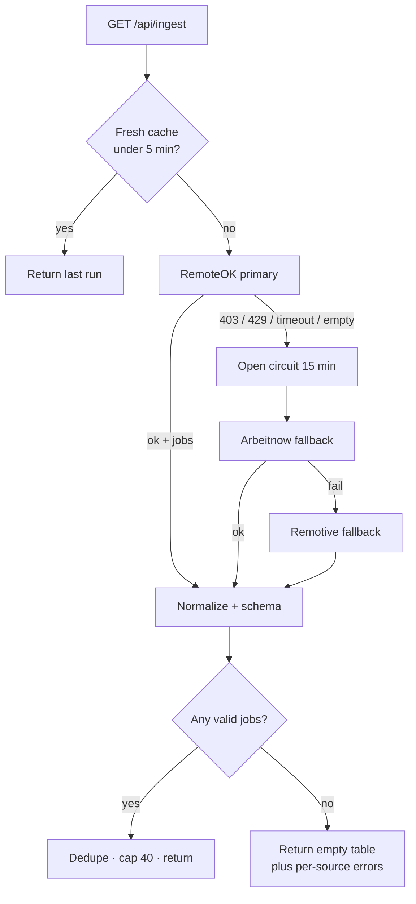

# Ingestion design

Live demo: `/ingest` on the deployed site. Code: `lib/ingest/run.ts`.

The brief names LinkedIn, Indeed, Naukri, and Wellfound as the real problem. It also tells candidates not to run the demo against a live LinkedIn account. This design takes that guardrail as the product requirement, not as a loophole to ignore.

## 1. Detection surface

Automated clients get burned on LinkedIn-class sites for boring reasons: a WebDriver flag or missing Chrome runtime, TLS fingerprints that do not match the User-Agent, datacenter IPs, no cookies from a normal browse path, request intervals that are too regular, and headers that look like a library default (`python-requests`, Go’s net/http).

This design accounts for those by **not impersonating a browser on those sites**. The live client talks only to documented public JSON feeds. It sends an honest User-Agent (`KeelIngest/1.0` plus the repo URL), `Accept: application/json`, and `Accept-Language`. It does not rotate identities, spoof fingerprints, or solve CAPTCHAs. If a feed starts requiring a browser, that feed is treated as closed — the circuit opens and a fallback feed is used.

## 2. Ingestion strategy

Primary: [RemoteOK’s public API](https://remoteok.com/api).  
Fallback 1: [Arbeitnow job-board API](https://www.arbeitnow.com/api/job-board-api).  
Fallback 2: [Remotive remote-jobs API](https://remotive.com/api/remote-jobs).

Pacing: 15s minimum between origin hits; 5-minute cache so a refresh-happy reviewer does not become a stampede. One request per origin per run, never a crawl.

Session/identity: none. These feeds are unauthenticated. There is no account to burn.

Plan B when a source dies in a week: the next feed in the list. Plan C: company ATS endpoints that are meant to be public (Greenhouse/Lever JSON for employers who publish them). Plan D, and the actual business answer: a licensed job-data vendor or a partnership. Headless scraping of LinkedIn is not a plan.

The UI toggle **Simulate primary block** forces RemoteOK into the skipped state so the fallback path is visible without attacking anyone.

## 3. Resilience

- **Timeouts:** 8s abort per source. A hang is a `timeout`, not a spinner forever.
- **HTTP 403/429:** circuit opens (honours `Retry-After` when present, else 15 minutes) so we stop poking a source that already said no.
- **Empty or shapeshifted markup/JSON:** parsers throw or return `empty`. Empty is not success. The next fallback runs.
- **Schema:** a row without `title`, `company`, and an `http` URL is dropped. We never pad the table.
- **All sources down:** the API still returns 200 with `jobs: []` and a note that nothing was invented. The UI says so in language a human can read.

Markup changes on LinkedIn are irrelevant here because we are not bound to their DOM. If RemoteOK changes their JSON, `parseRemoteOK` fails closed and Arbeitnow takes the traffic.

## 4. Where this stops

I will not log into LinkedIn/Indeed/Naukri/Wellfound as a bot, farm CAPTCHAs, buy residential proxies to look like a person, or ship stealth-browser configs. Those are ToS violations and they are how you get an IP or a person burned by Tuesday.

I will ingest feeds that are published as feeds, cache hard, fail loud, and switch sources when one goes away. That is how you get the listings out *repeatedly* without pretending the platform wanted you in their product.
